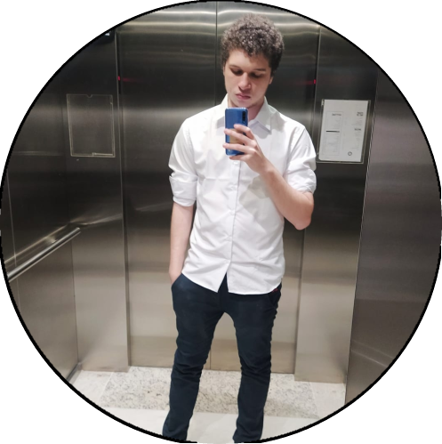

	
	<h1 align="center">Nicholas Ferreira</h1>

	

## Sobre mim :bearded_person:

&nbsp;

Olá :vulcan_salute:

Meu nome é Nicholas Mota Ferreira, sou bolsista na Faculdade Impacta de Tecnologia cursando bacharelado de Sistemas de Informação, tenho Técnico em Informatica na Etec, também possuo cursos como:
 
- API Restful com NodeJS, Restify e MongoDB (2020)
| Tarso Bessa - Arquiteto de Software
- React Native: Desenvolvimento APPs Nativas para Android e iOS (2020)
| Leonardo Moura Leitão - Arquiteto de Software
- SQL Completo (2018)
| Softblue
- Lógica de Programação (2017)
| Green Tecnologia

## Skills :man_technologist: :up:

### Back-end :computer: :back:

&nbsp;
&nbsp;
&nbsp;
&nbsp;
&nbsp;
&nbsp;

Atualmente trabalho no desenvolvimento de Back end, onde desenvolvo nas tecnologias: PHP 7 com CodeIgniter, MySQL, MongoDB, Ajax, jQuerry, SASS, React e NodeJS com Express utlizando REST.

### Front-end :computer: :soon:

&nbsp;
&nbsp;
&nbsp;
&nbsp;
&nbsp;
&nbsp;

Tenho experiência com desenvolvimento de aplicativos utilizando tecnologias e frameworks: HTML 5, CSS, SASS, JavaScript, ES6 +, Bootstrap e React.
### Mobile :iphone:

&nbsp;
&nbsp;

Desenvolvi aplicativos de pequeno porte em React Native e Android Kodlin
### Clouds :cloud:

&nbsp;
&nbsp;

Tenho experiência com desenvolvimento e CI/CD na AWS, como Pipeline, Codebuild, ECS, EC2, Lambdas, CloudFormation, S3, CloudFront, RDS, Elastic Beanstalk e muitos outros. Ja desenvolvi aplicações integradas com Firebase utilizando o Firestore, Authentication, Functions e outros.
 ### Tools :computer: :toolbox:

&nbsp;
&nbsp;
&nbsp;
&nbsp;
&nbsp;

Atualmente estou trabalhando com desenvolvimento utilizando: Git, Bitbucket, Visual Studio Code.

Além de trabalhar com metodologias ágeis: Scrum e Kanban